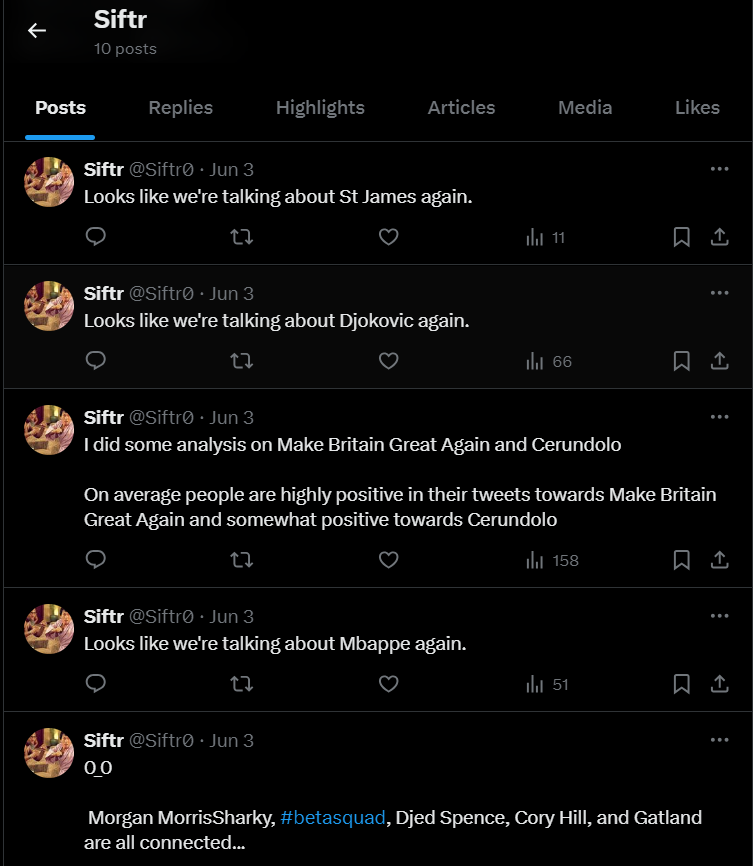

# Big Data Twitter Bot
Jacob Stenton

### Idea
The original idea for this project is to create a Twitter bot that lives off trends. The bot should analyze a sample of tweets underneath a trend to work out its average sentiment. Doing this allows the bot to compare trends and their sentiments to help understand the public's overall opinion on each subject.
### Twitter API
As Twitter's API has recently changed, it is impossible to scrape any data from Twitter without buying API access. To get over this hurdle, the project will use the Python library TwiKit. This is a library that bypasses Twitter's API and manually scrapes the data using a client's login. This isn't strictly allowed by Twitter, but for educational and practical purposes, there is no other option but to use a library such as TwiKit.

## Development
### Using Twikit
Twikit is a Python library for interacting with Twitter (X). It doesn't require an API key from Twitter. Instead, it takes a login and uses that to scrape and complete actions inside Twitter. Twikit's full range of capabilities can be found in the [documentation](https://twikit.readthedocs.io/en/latest/twikit.html). Using this library meant providing a login, so for safety and privacy reasons, a new Twitter account was made with a fresh email. This also came with the added benefit of having a 'non-bias' account to scrape with. Having a non-bias account is important as certain content wouldn't be pushed to the account's feed based on previous interactions. Settings that affected the feed based on location were also turned off.
### Protecting the Account
Certain protections should be considered when using Twikit to not alert Twitter to the presence of a bot. One small way is to simply add some images to the profile, like a profile picture and banner. This obviously isn't a foolproof plan, but it supposedly helps. One of the most important factors to take into account is Twitter's [rate limits](https://github.com/d60/twikit/blob/main/ratelimits.md). These are the number of requests that can be made in a specified time period (in this case 15 minutes). Hitting these limits shortly suspends access to Twitter and can cause Twitter to see the account as suspicious. These limits were closely considered throughout the entire development time to not have the account permanently suspended. This was especially cumbersome during certain tests as each test could only be run every 15 minutes.

### Scraping Trends
```python
def get_current_trends():
    # rate limit 20000 every 15m
    trends = client.get_trends('Trending') 
    trend_list = []
    for trend in trends:
            trend_list.append(trend.name)
    return trend_list
```
This example lists Twitter's current trends. It uses Twikit's client with our login to push each trend into a returned list. Here, the `get_trends` arguments can be changed to other search queries such as 'News', 'Sport' or 'Entertainment'. For this bot, it was kept as 'Trending' as this offers generally popular trends, rather than trends specific to sport or entertainment.

### Scraping Tweets
```python
def get_tweets_from_query(query):
    tweets = client.search_tweet(query, 'Top') #rate limit 50 every 15m
    tweet_list = []
    for tweet in tweets:
        _tweet = tweet.text.lower()
        _tweet = re.sub(r"(@\[A-Za-z0-9]+)|([^0-9A-Za-z \t])|(\w+:\/\/\S+)|^rt|http.+?", "", _tweet)
        _tweet = " ".join([word for word in _tweet.split() if word not in (stopwords.words('english'))]) #removes stopwords
        tweet_list.append(_tweet)
    return tweet_list
```
This function gets tweets from a search query - in this case, it will be a trend - and adds them to a list. It also cleans each tweet so that it can be run through some sentiment analysis later on. Cleaning involves making the tweet all lowercase, removing any links and special characters (including emojis), and then removing any stopwords. (Regex is from 'Cleaning text' in references.)

### Sentiment Analysis
#### Analysis Function
```python
sentiment = SentimentIntensityAnalyzer()

def get_avg_sentiment(tweets):
    tweet_sentiment = 0
    length = 0
    for tweet in tweets:
        pol_score = sentiment.polarity_scores(tweet)["compound"] 
        if pol_score > 0.0:
            tweet_sentiment += pol_score
            length += 1
    if length == 0:
        length = 1
    return (tweet_sentiment / length)
```
Now that we have clean data, we can get the sentiment of each tweet. This function takes a list of tweets and gathers the compound sentiment of each tweet, creating an average sentiment for each trend. If a tweet has a sentiment of 0, it is more likely that the tweet is unreadable than it is classed as completely neutral, so it is removed. The function then returns an average sentiment score for the list of tweets.

---
#### Listing Trends with Tweets
```python
current_trends = get_current_trends()
trends_tweets = []

for trend in current_trends:
    tweets = get_tweets_from_query(trend)
    time.sleep(random.randint(5,10))
    trends_tweets.append([trend,tweets])

trend_data = {
    "Trend" : [],
    "Sentiment" : [],
    "Last Seen" : []
}

for trend in trends_tweets:
    trend_data["Trend"].append(trend[0])
    trend_data["Sentiment"].append(get_avg_sentiment(trend[1]))
    trend_data["Last Seen"].append(datetime.datetime.now())
```
Each function can now be called to get all the relevant data we need from the bot. First, the trends, then the tweets from each trend, and finally the average sentiment for each trend. The date/time is also captured for later processing. As the search query rate limit is quite low, the program waits a couple of seconds in between collecting tweets to not raise suspicion.

### Similar Trends
Here, the goal is to find the most common words found in between each trend. This allows us to find which trends are linked together.

#### Frequency Distribution
```python
trend_words_fdist = []
tweet_string = ''
for trend in trends_tweets:
    for tweet in trend[1]:
        tweet_string += tweet
    tweet_tokens = nltk.word_tokenize(tweet_string)
    fdist = nltk.FreqDist(word for word in tweet_tokens)
    trend_words_fdist.append((trend[0], fdist))
    tweet_string = ''
```
The first step is to find the common words in all the collected tweets from a trend. This is done by mashing all the tweets into a singular string, tokenizing it, and then performing frequency distribution on the list of words. This returns each word with its frequency.

---
#### Finding the Nouns
```python
trend_words_fdist = []
tweet_string = ''
for trend in trends_tweets:
    for tweet in trend[1]:
        tweet_string += tweet
    tweet_tokens = nltk.word_tokenize(tweet_string)
    fdist = nltk.FreqDist(word for word in tweet_tokens)
    trend_words_fdist.append((trend[0], fdist))
    tweet_string = ''


trend_common_nouns = {
    'Trend': [],
    'Words': []
}
for trend in trend_words_fdist:
    _trend = trend[0]
    _fdist = trend[1]
    common_nouns = []
    for word in nltk.pos_tag(list(_fdist)):
        _word = word[0]
        _tag = word[1]
        if _fdist[_word] > 2 and _tag == "NN": # threshold
            common_nouns.append(_word)
    trend_common_nouns['Trend'].append(_trend)
    trend_common_nouns['Words'].append(', '.join(common_nouns))
```

To find words that have some sort of context or relevance, it made sense to filter the frequency distribution so that it only had nouns. This way, names, places, events, etc. (words that give context to the subject of a tweet) could be used to link different trends. So that trends don't get connected through words that only appear once, there is a threshold value set to only append words that appear more than twice. This can be increased to make the connections even more specific.

---
#### Updating / Recording Frequent Words
```python
old_trend_nouns = pd.read_csv("Common_Words.csv").to_dict(orient="list")

for trend in enumerate(trend_common_nouns['Trend']):
    if trend[1] not in old_trend_nouns['Trend']:
        old_trend_nouns['Trend'].append(trend[1])
        old_trend_nouns['Words'].append(trend_common_nouns['Words'][trend[0]])
    else:
        index = old_trend_nouns['Trend'].index(trend[1])
        words = old_trend_nouns['Words'][index].split(", ")
        _words = trend_common_nouns['Words'][trend[0]].split(", ")
        for word in _words:
            if word not in words:
                old_trend_nouns['Words'][index] += f", {word}"

pd.DataFrame.from_dict(old_trend_nouns).to_csv("Common_Words.csv", index=0,)
```
Each trend and its common nouns are then recorded in a CSV. If the trend is already in the CSV, then the new words are added to the trend; otherwise, the frequent words and the trend are recorded in a new line.

```
    Trend,Words
    Maya Jama,"jama, maya, loveislandmaya, loveisland, year, one"
    Patsy,"patsy, loveislandpatsy, bed, mum, shares, sharing"
    #GardensHour,"amp, gardenshour, finally, garden, rose, full, see, bloom, well, really, love"
    Branthwaite,"branthwaite, england, jarrad, make, wharton, carlisle, debuts, season"
    Samantha,"samantha, de, hudson, una, trans, en, como, su"
    Ciaran,"loveislandciaran, ciaran, harriet"
    St James,"james, st, park, england, rob, burrow, tonight, newcastle, bosnia, amp"
    Anas Sarwar,"sarwar, scotland, labour, anas, tory, change, years, amp, money, ross, would, scottish, deliver, 14, austerity, cuts, nhs, swinney, accept, anassarwar, spending"
```
^sample of common_words.csv^

---
#### Finding Similar Trends
```python
grouped_trends = {
    'Trend' : [],
    'Matches' : []
}

for words in enumerate(trend_common_nouns['Words']):
    matches = []
    for _words in enumerate(old_trend_nouns['Words']):
        for word in words[1].split(', '):
            if type(_words[1]) == str: # avoids null/nan values
                if word in _words[1].split(', ') and trend_common_nouns['Trend'][words[0]] != old_trend_nouns['Trend'][_words[0]]:
                    matches.append(old_trend_nouns['Trend'][_words[0]])
                    break
    if len(matches) != 0:
        grouped_trends['Trend'].append(trend_common_nouns['Trend'][words[0]])
        grouped_trends['Matches'].append(', '.join(matches))
```
Finally, we can connect trends. This function uses the CSV of words and trends to create links between trends based on shared words. This means that if a trend has a similar word to another, it will connect them.

### Recording data
```python
history = pd.read_csv("trends.csv").to_dict(orient="list")
returning_trends = []
calc_trend_data = trend_data

for trend in enumerate(history["Trend"]):
    if trend[1] in calc_trend_data["Trend"]: #seen trend before
        new_trend_index = 0
        for _trend in calc_trend_data["Trend"]:
            if _trend == trend[1]:
                break
            else:
                new_trend_index += 1
                
        if history["Last Seen"][trend[0]][:10] != str(calc_trend_data["Last Seen"][new_trend_index].date()):#if not same day
            returning_trends.append((history['Trend'][trend[0]],history["Last Seen"][new_trend_index][:10]))
            history["Last Seen"][trend[0]] = calc_trend_data["Last Seen"][new_trend_index] #overwrite date

        history["Sentiment"][trend[0]] = (history["Sentiment"][trend[0]] + calc_trend_data["Sentiment"][new_trend_index]) / 2 

        calc_trend_data["Trend"].pop(new_trend_index)
        calc_trend_data["Sentiment"].pop(new_trend_index)
        calc_trend_data["Last Seen"].pop(new_trend_index)
```
Now comes the task of storing all the new data collected. This is a little complicated and could be simplified a lot, but it works. It works by reading the previously stored data, given it has been run before, and then iterating through it to check if any new trends match the historical trends. If they do and they weren't added on the same day, then the trend is added to a `returning_trends` list. The historical trend is then updated to the current day's date/time.

---

```python
for i in range(len(calc_trend_data["Trend"])):
    history["Trend"].append(calc_trend_data["Trend"][i])
    history["Sentiment"].append(calc_trend_data["Sentiment"][i])
    history["Last Seen"].append(calc_trend_data["Last Seen"][i])
```
If the trends don't match then the trend, sentiment and date/time last seen is added to the end of the csv.
```
    Trend,Sentiment,Last Seen
    Maddison,0.5190285714285714,2024-06-03 22:04:48.160838
    Maya Jama,0.5819333333333334,2024-06-03 22:04:48.162828
    Patsy,0.42159166666666664,2024-06-03 22:04:48.163827
    #GardensHour,0.5742769230769231,2024-06-03 22:04:48.171814
    Branthwaite,0.6368800000000001,2024-06-03 22:04:48.175786
    Samantha,0.5457875,2024-06-03 22:04:48.180769
    Ciaran,0.4006142857142857,2024-06-03 22:04:48.195719
    Anas Sarwar,0.48911999999999994,2024-06-03 22:04:48.209670
```
^Sample of trends.csv^

```python
new_df = pd.DataFrame.from_dict(history)
new_df.to_csv("trends.csv", index=0,)
```

The data is then written to the trends csv file using pandas.
### Twitter Post
The last step is to return the findings. As the bot takes everything from twitter, why not send it back by posting onto the account.

```python
if date.day % 7 == 0 and cycle == 18:
    post_all_time_ranks()
    time.sleep(10)

if cycle % 4 == 0:
    if random.randint(1,2) == 2:
        post_opposite_trends()
    else:
        post_linked_trends()

time.sleep(10)
post_returned_trends()
```

This short block of code decides what is to be posted and when. It does this by randomizing the tweet it sends out. Here, the bot is set to tweet about the all-time top and bottom sentiment trends every 7 days at 6 pm. 'Cycle' is simply the hour of the day (24 cycles in a day). Additionally, every 4 hours, it either posts the current top/bottom sentiment trend (of that hour/day) or the trends that are linked together through words. It always posts if a trend has returned, as trends can change hourly.

#### Tweet Variations

```python
def post_opposite_trends(): #Top and bottom trend sentiment
    df = pd.DataFrame.from_dict(trend_data)
    top = df.sort_values("Sentiment").tail(1)
    top = pd.DataFrame.to_dict(top, orient="list")
    bottom = df.sort_values("Sentiment").head(1)
    bottom = pd.DataFrame.to_dict(bottom, orient="list")

    template = random.randint(1,3)
    if template == 1:
        tweet = f"A lot of {sentiment_to_words(bottom['Sentiment'][0])} views radiating from the people talking about {bottom['Trend'][0]}. Perhaps the people yapping about {top['Trend'][0]} can chime in?"
    elif template == 2:
        tweet = f"Honestly, the fact everyones views are {sentiment_to_words(top['Sentiment'][0])} about {top['Trend'][0]} is quite interesting if you think about it."
    elif template == 3:
        tweet = f"I did some analysis on {top['Trend'][0]} and {bottom['Trend'][0]}\n\nOn average people are {sentiment_to_words(top['Sentiment'][0])} in their tweets towards {top['Trend'][0]} and {sentiment_to_words(bottom['Sentiment'][0])} towards {bottom['Trend'][0]}"
        
    client.create_tweet(tweet)
```

`post_opposite_trends` tweets the trends with the highest and lowest sentiments. It has three variations that can be chosen using a random number between 1 and 3. It also makes use of another function below, which takes a sentiment score and turns it into readable words, which seem more appropriate for Twitter.
```python
def sentiment_to_words(score):
    score = int(score * 100) 
    string = ''
    if score in range(-5, 5):
        string = 'neutral'
    elif score in range(-20, -5) or score in range(5, 20):
        string += 'slightly'
    elif score in range(-40, -20) or score in range(20, 40):
        string += 'somewhat'
    elif score in range(-60, -40) or score in range(40, 60):
        string += 'mostly'
    elif score in range(-80, -60) or score in range(60, 80):
        string += 'highly'
    elif score in range(-100, -80) or score in range(80, 100):
        string += 'extremely'

    if string != 'neutral':
        if score > 0:
            string += ' positive'
        else:
            string += ' negative'

    return string
```

---

```python
def post_returned_trends():
tweet = ''
if len(returning_trends) > 1:
    tweet = f"Hey! I've seen all this before...\n"
    for trend in returning_trends: #trend = ("trend","last seen")
        if len(tweet) < 90:
            tweet += f"{trend[0]} on {trend[1]}\n"
        else:
            break
    tweet += "I suppose they're all important topics."
elif len(returning_trends) == 1:
    tweet = f"Looks like we're talking about {returning_trends[0][0]} again."

if tweet != '':
    client.create_tweet(tweet)
```

Returning trends include every trend that has been seen before on any previous date. Sometimes there can be a lot of returning trends. To avoid going over Twitter's max-tweet-length, the tweet created is limited to a length of 90, with a small sentence added at the end.

---

```python
def post_all_time_ranks():
    all_bottom = new_df.sort_values("Sentiment").head(3)
    all_bottom = pd.DataFrame.to_dict(all_bottom, orient="list")
    all_top = new_df.sort_values("Sentiment").tail(3)
    all_top = pd.DataFrame.to_dict(all_top, orient="list")

    template = random.randint(1,3)
    if template == 1:
        tweet = f"Isn't it fascinating that {all_top['Trend'][0]}, {all_top['Trend'][1]} and {all_top['Trend'][2]} get the most positve views! I could talk about it all day!"
    elif template == 2:
        tweet = f"It appears {all_bottom['Trend'][0]}, {all_bottom['Trend'][1]} and {all_bottom['Trend'][2]} are the lowest of the low in terms of sentiment. I wonder why?"
    elif template == 3:
        tweet = f"People talk highly of {all_top['Trend'][0]}, {all_top['Trend'][1]} and {all_top['Trend'][2]} but so lowly of {all_bottom['Trend'][0]}, {all_bottom['Trend'][1]} and {all_bottom['Trend'][2]}. Anyone have any thoughts on this?"
        
    client.create_tweet(tweet)
```

This posting function uses pandas to read to top and bottom 3 trends based on seniment and tweets them out using 3 randomly chosen templates.

---

```python
def post_linked_trends():
    index = random.randint(0,len(grouped_trends['Trend'])-1)
    links = grouped_trends['Matches'][index].split(", ")

    template = random.randint(1,3)
    if template == 1:
        tweet = f"For anyone interested in {grouped_trends['Trend'][index]}, you might also be interested in {links[random.randint(0,len(links))-1]}"
    elif template == 2:
        if len(links) != 1:
            tweet = f"0_0\n\n {grouped_trends['Trend'][index] }"
            for trend in enumerate(links):
                if trend[0] == len(links)-1:
                    tweet += f"and {trend[1]} are all connected..."
                else:
                    tweet += f"{trend[1]}, "
        else:
            tweet = f"0_0\n\n{grouped_trends['Trend'][index]} and {links[0]} are connected..."
    elif template == 3:
        tweet = f"Ever think about how {grouped_trends['Trend'][index]} and {links[random.randint(0,len(links))-1]} are linked?"
        
    client.create_tweet(tweet)
```

Linked trends includes the same randomly chosen template and uses the prviously created 'grouped_trends' to tweet about the trends linked to the current trends.

#### Scheduling
The complete script now runs every 2 hours from a laptop (it doesn't always run). Everything was completed with this [twitter (X) account](https://x.com/Siftr0). There is a chance that the account may be suspended in the future. It already recieves some account locks to check its not a bot.

However, here is proof that is has indeed been working.

The account is also sometime logged out, so without manual intervention it can suddenly stop scraping and posting.

### Plot
To create some sort of visualisation for the project the networkX library was used along with matplotlib.

```python
for i, row in all_common_df.iterrows():
    trend = row['Trend']
    words = row['Words'].split(', ')
    G.add_node(trend)    
    for j, other_row in all_common_df.iterrows():
        if i >= j:
            continue
        other_trend = other_row['Trend']
        other_words = other_row['Words'].split(', ')
        common_words = set(words).intersection(set(other_words))        
        if common_words:
            G.add_edge(trend, other_trend, weight=len(common_words))
```
To create the visualization, the previously create common_trends csv was used. The code iterates through each line of the csv and checks each trend with every other trend using a set. If there are words shared between the two trends then an edge is added to the plot with the location of both trends.
```python
plt.figure(figsize=(100, 90))

pos = nx.spring_layout(G, k=1,)
nx.draw_networkx_nodes(G, pos, node_size=1000, node_color='white')

edges = G.edges(data=True)
nx.draw_networkx_edges(G, pos, edgelist=edges, width=0.2)

nx.draw_networkx_labels(G, pos, font_size=10, font_family='sans-serif')

plt.title("Connected Trends")
plt.show()
```
Here the plot is created and each node, edge and label is drawn and connected. This is the output graph. Its a large 20mb image so its difficult to read at this size but its possible to zoom in on it in the [real image](imgs/SImilarTrends.png)


It's a very interesting visualization to look at, and it will only get more complicated and intriguing the more the bot runs. This particular plot is formed of around 200 trends.

## Conclusion

Altogether, the project has been extremely interesting. As Twitter trends change every few hours, new links and opinions form between the subjects and the people talking about them. The final plot shows that many of our social groups and opinions are closely linked, with only a few subjects having no link to another. With a few extra measures in place for account safety, this bot could theoretically run for as long as Twitter does, provided Twitter doesn't change too much.

## References

Learning and using twikit: 
- https://blog.apify.com/how-to-scrape-tweets-and-more-on-twitter-59330e6fb522/
- https://twikit.readthedocs.io/en/latest/twikit.html

Cleaning text:
- https://monkeylearn.com/blog/text-cleaning/

NetworkX:

- https://www.youtube.com/watch?v=flwcAf1_1RU&ab_channel=ProfessorFoote
- https://www.geeksforgeeks.org/python-visualize-graphs-generated-in-networkx-using-matplotlib/
- https://networkx.org/documentation/stable/reference/index.html