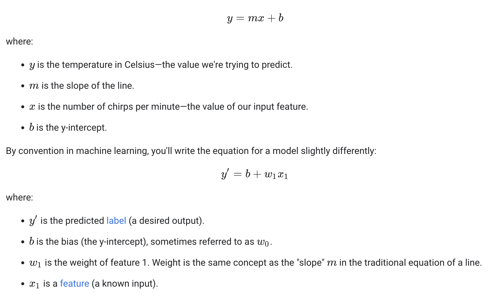

## What is Machine Learning?
Machine Learning is the general term for when computers learn from data. 
Machine Learning is at the intersection of computer science and statistics through which 
computers receive the ability to learn without being explicitly programmed.

There are two broad categories of Machine Learning problems: supervised and unsupervised learning.

### Supervised learning Example 
Here the machine learns from labeled datasets
- Classification: Classification means to group the data to a class. If the algorithm labels the input into two distinct classes, it is called binary classification if it is more than two classes is referred to as multiclass classification.
- Regression : In Regression we predict a single output value using training data.
  - Linear Regression 
  
  
    
### Unsupervised learning
Unsupervised learning is about the training of a machine using information that is not labeled and allowing the algorithm to learn without guidance
- Clustering: A clustering problem is where you want to discover the inherent groupings in the data, such as which emails are spam or not, or which customers share the same behaviour.

### Reinforcement learning
Reinforcement learning is a machine learning training method based on rewarding desired behaviors and/or punishing undesired ones. 
In general, a reinforcement learning agent is able to perceive and interpret its environment, take actions and learn through trial and error

## Deep learning 
Deep Learning algorithms are sophisticated and mathematically complex evolution of machine learning algorithms
Deep Learning describes algorithms that analyze data with a logical structure similar to how a human would draw conclusions. 
Note that this can happen both through supervised and unsupervised learning. 
To achieve this, Deep Learning applications use a layered structure of algorithms called an artificial neural network (ANN). The design of such an ANN is inspired by the biological neural network of the human brain, leading to a process of learning that’s far more capable than that of standard machine learning models.

A Neuron

The Linear Unit:  𝑦=𝑤𝑥+𝑏

Deep Learning architecture

### References
https://levity.ai/blog/difference-machine-learning-deep-learning

https://developers.google.com/machine-learning/crash-course/descending-into-ml/linear-regression

https://www.techtarget.com/searchenterpriseai/definition/reinforcement-learning

