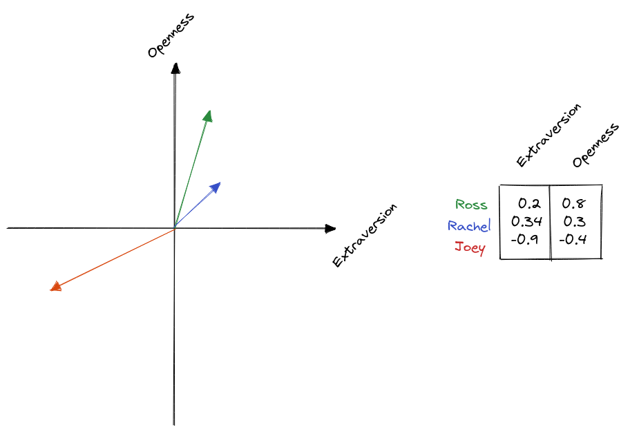
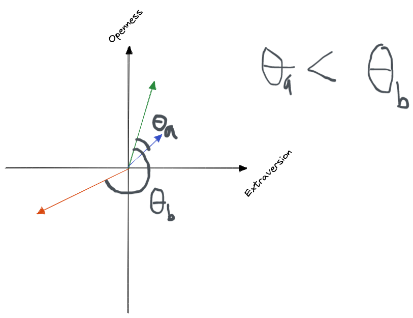
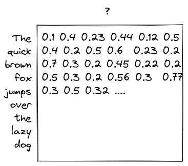
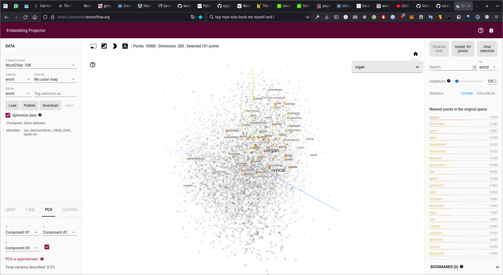

# Word2Vec

> In natural language processing (NLP), word embedding is a term used for the representation of words for text analysis, typically in the form of a real-valued vector that encodes the meaning of the word such that the words that are closer in the vector space are expected to be similar in meaning. [[Source](https://en.wikipedia.org/wiki/Word_embedding)]

> The word2vec algorithm uses a neural network model to learn word associations from a large corpus of text. Once trained, such a model can detect synonymous words or suggest additional words for a partial sentence. As the name implies, word2vec represents each distinct word ... as a vector. The vectors are chosen carefully such that a simple mathematical function (the cosine similarity between the vectors) indicates the level of semantic similarity between the words represented by those vectors. [[Source](https://en.wikipedia.org/wiki/Word2vec)]

In short Word2Vec is a _word embedding_ technique which allows you to represent a word as a vector. This then allows you to preform mathematical calculations and tricks with those vectors - such as compare similarity, infer context or suggest the next word in a sequence.

### Data as Vectors

A single data point could be made up of a number of indivdual components. Take for example a persons score in the Big 5 Personality test which would comprise of 5 individual numbers corresponding to _Openness_, _Conscientiousness_, _Extraversion_, _Agreeableness_ and _Neuroticism_. For simplicities sake, lets just take 2 of those and plot them as vectors:

You can immediately get a sense of which vectors are more similar.

### Cosine Similarity

You can get a definite measure of similarity using the _Cosine Similarity_ - this just gives the angle between two vectors.

Two vectors pointing in the same direction will have a similarity of 1, orthogonal vectors have a cosine similarity of 0 and two opposite vectors have a similarity of -1.

In vector space we can also ask things like _what is the difference between two vectors?_ (subtract the two) or _how far apart are two vectors?_ (find the Euclidean distance).

### Word Embedding

Clearly it is useful to have vector representations of data. The process of turning a word into a vector is known as _word embedding_ - but how to we get to the point where each word has a vector representation?

> This is going to be very high-level and not explain the detail at all as ultimately it's a machine learning process which covers too much ground. However, you will no doubt come across this again in your time at CCI where a prior knowledge of nerual networks will make explaining the process at a lower level much easier.

Essentially a vector representation of each word is _learned_ just by looking at the context of each word (the surrounding words).

The vector representation of each word starts off as a random series of numbers.

In training we compare the similarity of each word with a series of other words:

We can measure an error value from this based on the real _target value_:

Once trained we will have a vector representation of each word in the _corpus that we trained on_.

[[Images Source](https://jalammar.github.io/illustrated-word2vec/)]

---

Have a look at the [Embedding Projector](https://projector.tensorflow.org/) to see the Word2Vec embeddings visualised.
