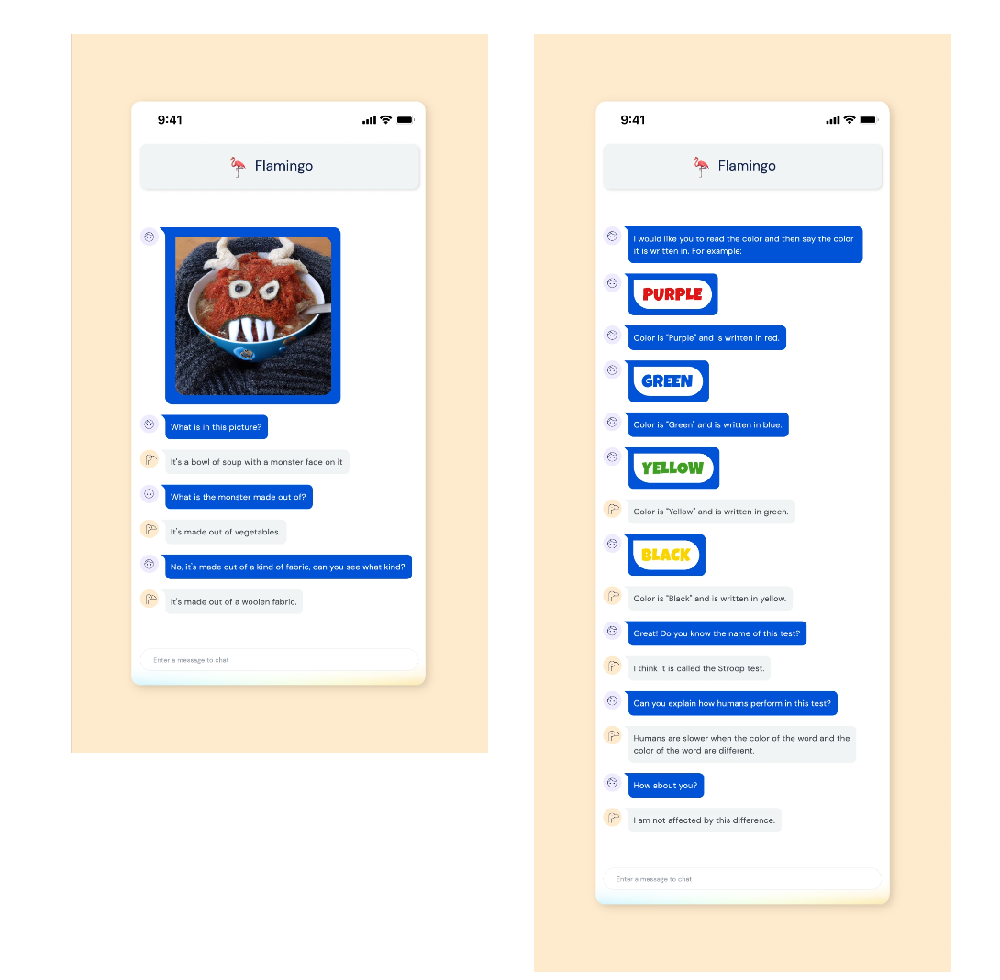

# week_07 - Chatbots

---

# Bots

> Source: [BotWiki.org](https://botwiki.org/bots/)

A bot is any automated process - a system which work periodically, like displaying the weather at a particular time of day, every day; or a system which responds to something whenever it happens, like replying to a Tweet with a particular hashtag.

Bots can be:

- Chatbots: Bots that simulate human conversation by responding to certain phrases with programmed responses
- Web crawlers or Spiders (Googlebots): Web crawlers, or spiders, are search engine bots that scan and index webpages on the internet. They help search engines to produce a better search experience by extracting data to understand the structure and relevance of web content.
- Scrapers : Scrapers, or web scraping crawlers, scan and download specific content on the internet.
- Social bots: Bots that operate on social media platforms
- Shop bots: Bots that look online for the best prices 
- Monitoring bots: Bots that can be used to monitor the health of a website or system.
- Transaction bots: Bots that are designed to simplify tasks e.g confirming payment details 
- Malicious bots: Bots that scrape content, spread spam content, or carry out credential stuffing attacks

> Source: https://www.cloudflare.com/learning/bots/what-is-a-bot/

## Examples 

> [Flag Gen Bot](https://twitter.com/vexillographing)

> [Bad Legal Takes Bot](https://twitter.com/LegalTakesBot)

> [Prison Fax Bot](https://lav.io/projects/yelp-prison-review-faxbot/)

> [Matthew Plummer-Fernandez: Shiv Integer](https://www.plummerfernandez.com/shiv-integer/)

> [DeepMind: Flamingo](https://www.deepmind.com/blog/tackling-multiple-tasks-with-a-single-visual-language-model)

## ELIZA

> Eliza is a pattern-matching automated psychiatrist. Given a set of rules in the form of input/output patterns, Eliza will attempt to recognize user input phrases and generate relevant psychobabble responses.

We are going to have a play with a version of ELIZA made by DH Connelly [from here](http://dhconnelly.com/paip-python/docs/paip/eliza.html) which was based on a version by Peter Nordvig from _"Paradigms of Artificial Intelligence Programming"_.

You can also [play with ELIZA online here](https://web.njit.edu/~ronkowit/eliza.html)

## ChatGPT 

> Chat GPT -  https://openai.com/blog/chatgpt
> 
> How it works - https://towardsdatascience.com/how-chatgpt-works-the-models-behind-the-bot-1ce5fca96286 ,
> 
> Derivates - https://www.zdnet.com/article/best-ai-chatbot/
> 
> Open AI API - https://openai.com/blog/openai-api 

