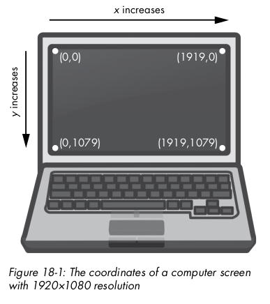

# PyAutoGUI

PyAutoGUIis an amazing and powerful package, but giving up control of your mouse and keyboard natrually comes with some risks so **be careful**!

[**See the official documentation for more features.**](https://pyautogui.readthedocs.io/en/latest/quickstart.html)

### Installation

[**See Here.**](https://pyautogui.readthedocs.io/en/latest/install.html)

### Pauses and Failsafes

```python
# Pause 1 sec after every command
pyatuogui.PAUSE = 1
# Move mouse to top left corner of screen to deliberately crash the program
pyatuogui.FAILSAFE = True
```

### Screen Coordinates



```python
# Get screen size
pyautogui.size() # -> (1920, 1080)
# Destructure type
width, height = pyautogui.size() # width == 1920, height == 1080
```

### Mouse Movement

`moveTo` for _absolute_ movement (screen coordinates)

```python
for i in range(10):
    pyautogui.moveTo(100, 100, duration=0.25)
    pyautogui.moveTo(200, 100, duration=0.25)
    pyautogui.moveTo(200, 200, duration=0.25)
    pyautogui.moveTo(100, 200, duration=0.25)
```

`moveRel` for _relative_ movement

```python
for i in range(10):
    pyautogui.moveRel( 100,   0, duration=0.25)
    pyautogui.moveRel(   0, 100, duration=0.25)
    pyautogui.moveRel(-100,   0, duration=0.25)
    pyautogui.moveRel(   0,-100, duration=0.25)
```

### Mouse position

```python
pyautogui.position()
```

### Clicking

```python
pyatuogui.slick(10, 5)
```

### Dragging

```python
pyatuogui.dragRel(100, 10, duration=0.3)
```
