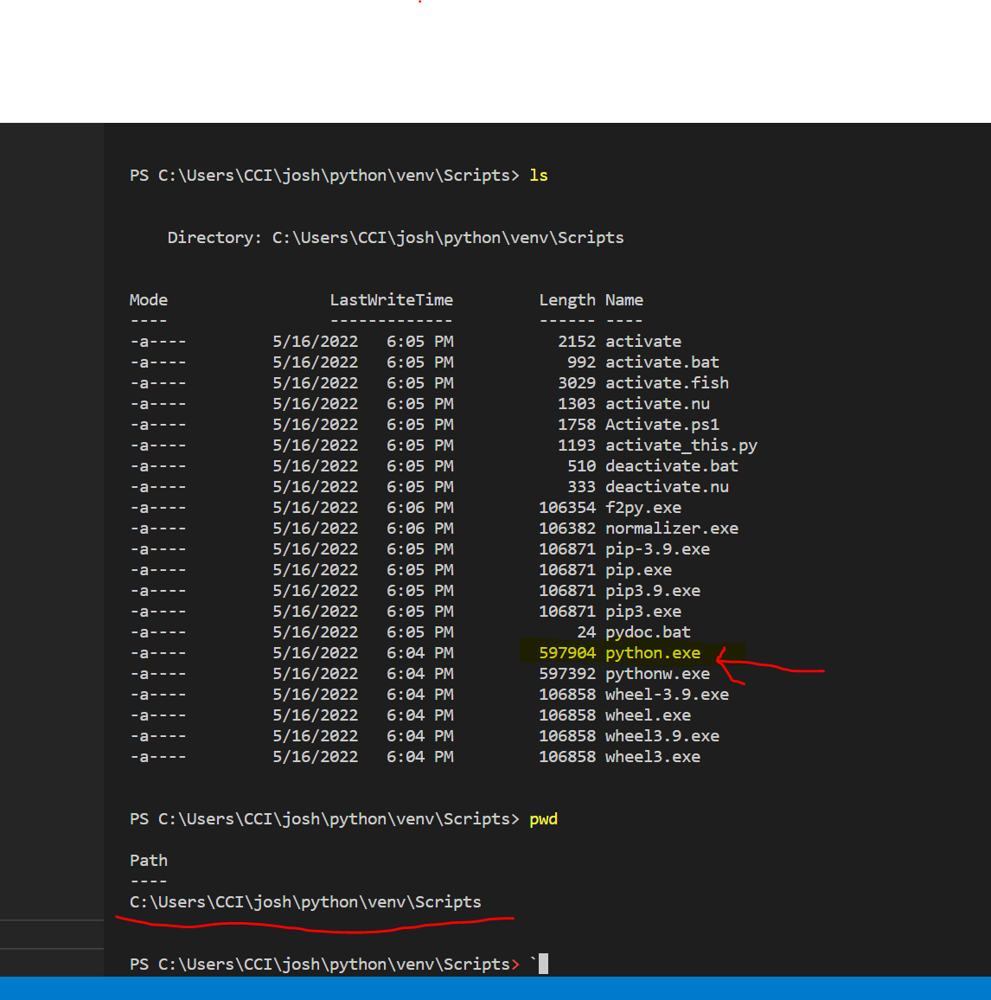
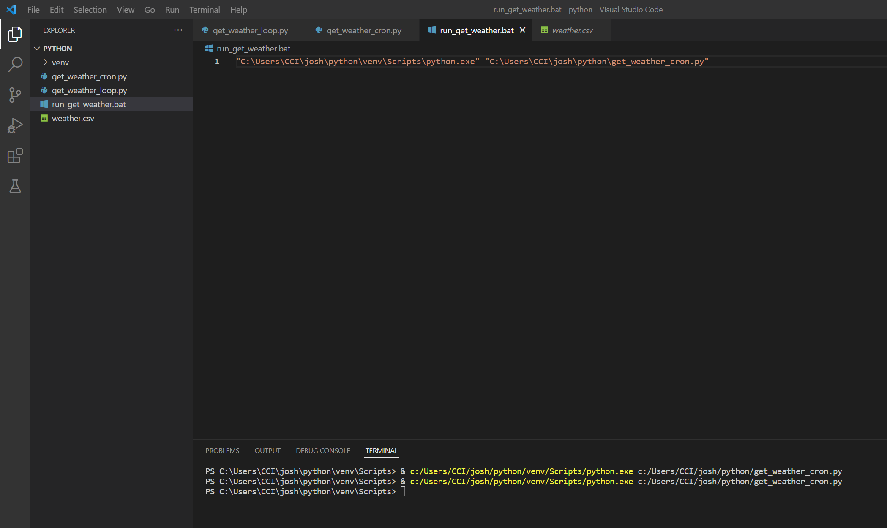
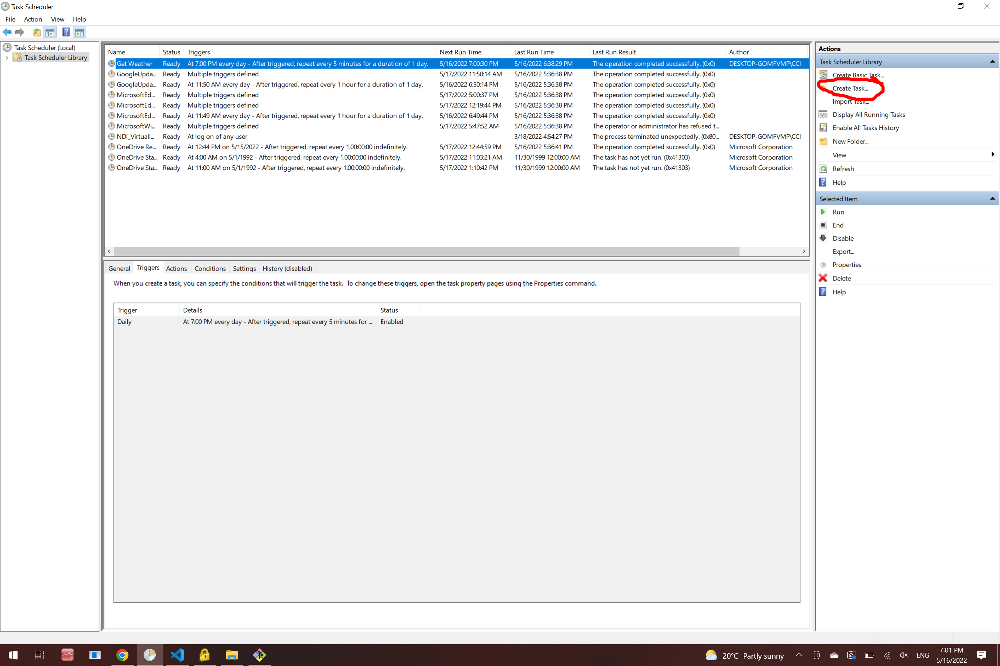
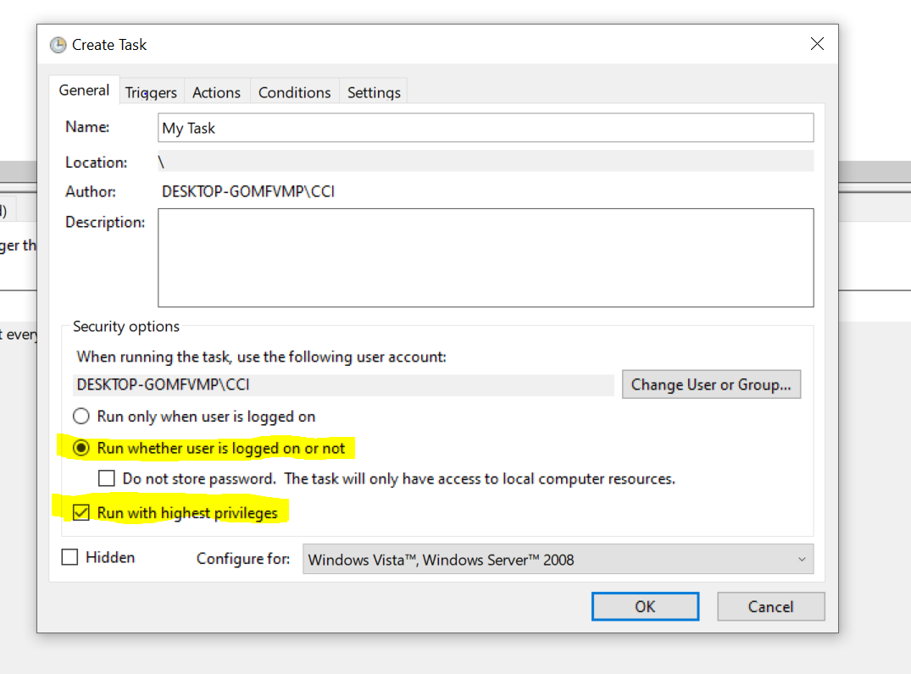
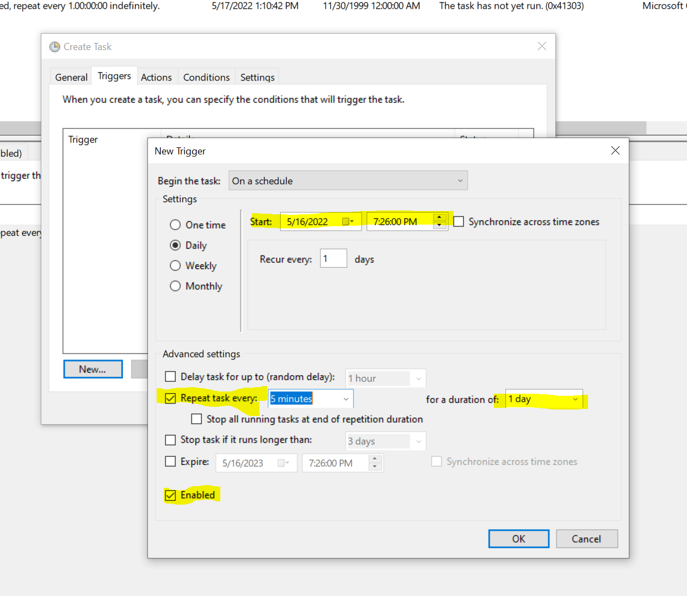
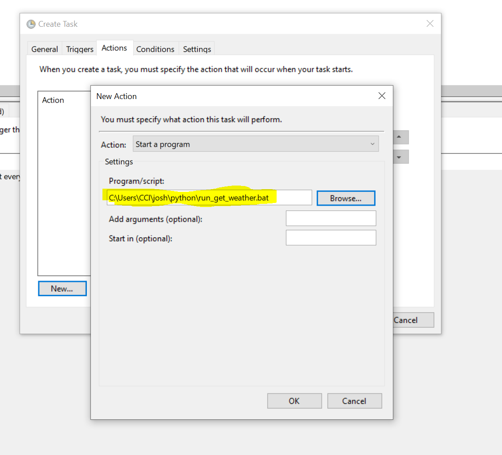
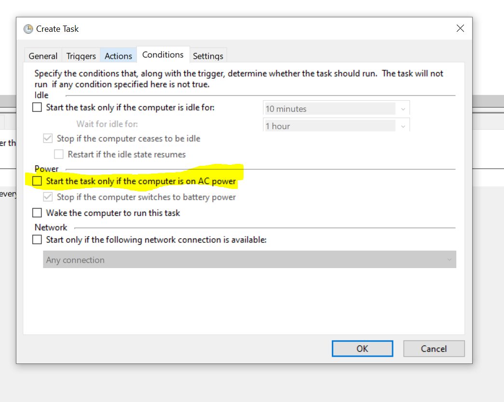

# Scheduling Tasks

## CRON Jobs

### MacOS / Linux

A CRON job is just an action you can schedule on your machine to run at particular intervals.

In Terminal running `crontab -l` will show your current CRON jobs in the _crontab_ file. This isn't really a file however. To edit you need to run `crontab -e` which is where you can add CRON jobs.

A typical CRON task will be a one line entry which will look something like:

```bash
* * * * * python myScript.py
```

The asterixes represent the blocks of time and an asterix itself (`*`) means _every_.

```bash
# Example of job definition:
# .---------------- minute (0 - 59)
# |  .------------- hour (0 - 23)
# |  |  .---------- day of month (1 - 31)
# |  |  |  .------- month (1 - 12) OR jan,feb,mar,apr ...
# |  |  |  |  .---- day of week (0 - 6) (Sunday=0 or 7) OR sun,mon,tue,wed,thu,fri,sat
# |  |  |  |  |
# *  *  *  *  * user-name  command to be executed
```

The command above means _every minute, everyday, forever_...

This means _every 5th minute_:

```bash
*/5 * * * * <command-to-execute>
```

_every 15 minutes_:

```bash
*/15 * * * * <command-to-execute>
```

_every hour at the 33 minute_:

```bash
33 * * * * <command-to-execute>
```

The following cron job will run three times every hour, at minute 0, 5 and 10:

```bash
0,5,10 * * * * <command-to-execute>
```

Run a job _every 6 months_:

```bash
0 0 1 */6 * <command-to-execute>
```

The `crontab` syntax is pretty weird and not very intuitive. So [see here](https://ostechnix.com/a-beginners-guide-to-cron-jobs/) for many more examples or use a (`crontab` generator like this one](https://crontab-generator.org/).

you can also specify the log location 

```bash
* * * * * myjob.sh >> /var/log/myjob.log 2>&1
```

## Task Manager

### Windows

This work a bit differently on Windows. Windows being... _windows_, naturally there is a GUI application for setting up scheduled tasks. This is a bit of a process, but the same concept.

First you need to make a `.bat` file which holds the command you want to execute. This will hold the equivalent of `python myScript.pt` but you need to use the **absolute path** to the Python you want to use and the script you want to run.

Now, if you used a virtual environment when making your Python program you will want to use that Python. You can find that by going _into_ the virtual environment folder you created, and then into `\Scripts` and then in there you will find a `python.exe`. See below:



Similarly you need the absolute path_ to the Python script you want to run. This will lead to a `.bat` file which looks like so:



Next you need to open **Task Manager** (search for it in your _Start_ menu if needs be) and click on **Create Task** at the top right:



In there make sure to check _Run whether user is logged in or not_ and _Run with highest privileges_:



Next you set the triggers, note all the highlighted bits:



Then the action. This is what you actually want to run. Here you should _browse_ for the `.bat` file you created:



Finally you set the conditions. Here I just make sure to turn **off** _Start the task only if the computer is on AC power_ so that it runs whether plugged in or not:


