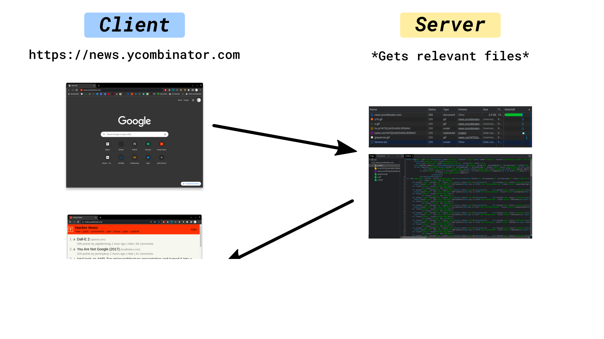
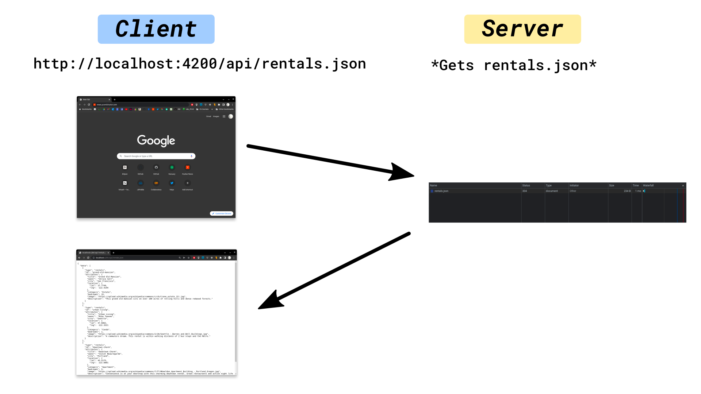
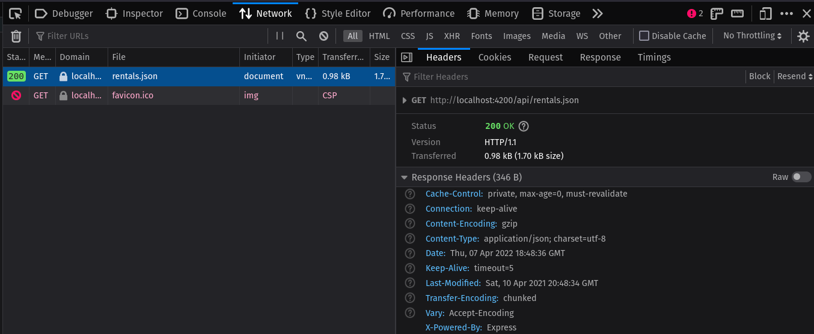
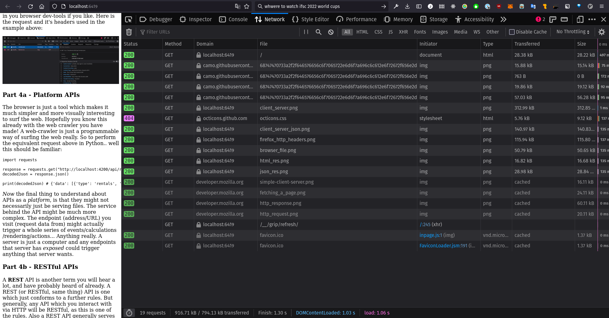
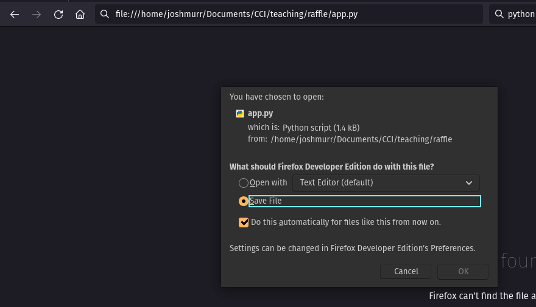
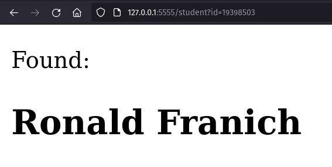
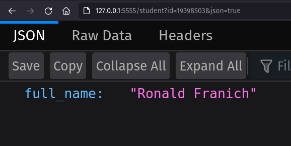

# APIs - An Introduction

---

### API - Application Programming Interface

And API in short is __the interface (in code) between your software and some other third-party service__. For example, imagine there is some service out there which provides a map based on a geolocation you can provide. You _could_ go to Google maps and just type in the location and view the map, but perhaps you merely want the data (in this case lets assume it is an image) to embed into your own app. _If_ that service (or platform) has an API to it's underlying infrastructure, you could use the API to access and retrieve the data.

This is not limited to the web however - if you've ever used a Python package or a JavaSript library like P5, the way you write code to access the methods within the library is also an API. The API merely defines how you as the programmer access the services provided by the platform.

---

### Part 1 - Some basic and probably contrived API examples

> This may seem a little off topic, but API is a term you'll see all over the place in many different contexts so this is about APIs _generally_.

Lets say I wanted to write my own string concatenation library. Most languages have some form of this built in, but the way in which the end user (in this instance, the programmer) actually performs string concatenation is ultimately down to the people designing the language.

I could write a simple function like so:

```python
# stringConcatenation.py
def concatenate(a, b):
    return a + b
```

> Technically I'm doing nothing here, I am actually using the built in Python string concatenation, but bare with me...

This could be used like so:

```python
# main.py
import concatenate from stringConcatenation

strA = "Hello,"
strB = " World!"

result = concatenate(strA, strB)
print(result) # "Hello, World!"
```

This is fine.. But there are other ways of doing this. I could also go the class route which would change things:

```python
class MyString:
    def __init__(self, content):
        self.content = content

    def concatenate(self, b):
        # Concatenate string b with currently stored string
        self.content = self.content + b
        return self.content
```

This would be used like so:

```python
myString = MyString("Hello, ")
myString.concatenate("World!")

print(myString.content) # "Hello, World!"
```

That really is contrived... But hopefully you're beginning to see the programmers of libraries make certain decisions about how to structure their API which ultimately influence how you as a programmer access the services they are providing. This is why _Application Programming Interface_ is such a broad term.

---

### Part 2 - How the web works (kind of)

_In a nutshell_, when you're surfing the web, you are telling your browser visit certain _addresses_. These addresses are the literal address of other computers which have files/images/data stored. Depending on the exact address, or sub-address entered, you will get the relevant files associated with that address returned. "Visiting the address" inherently involves some kind of request (you are asking for data of some kind) and the server with respond with the relevant _response_, normally containing the files you want - the _server_ has _served_ you the files.


For example:



That's basically it... You visit an address, which is the [URL](https://developer.mozilla.org/en-US/docs/Learn/Common_questions/What_is_a_URL), the server at the other end of that address collates the relevant files you're after and then sends them back to you. More often than not these files are parsed by your browser and turned into webpages (thanks the HTML, CSS and JavaSript).


__However!__ The _endpoint_ you are visiting (which is another way of saying address) doesn't _need_ to be serving a webpage. There could be anything there! Like JSON perhaps:



In this instance the browser is still parsing and displaying the JSON data... But we've been making HTTP requests in Python for a few weeks now... :thinking:

### Part 3 - HTTP

> HTTP is a protocol for fetching resources such as HTML documents. It is the foundation of any data exchange on the Web and it is a client-server protocol, which means requests are initiated by the recipient, usually the Web browser. A complete document is reconstructed from the different sub-documents fetched, for instance, text, layout description, images, videos, scripts, and more. 

> Source: [An overview of HTTP - Mozilla](https://developer.mozilla.org/en-US/docs/Web/HTTP/Overview)

In the diagram below, you (or your browser) is the thing on the left, making requests for all the resources which make up that web page.


The internet is _all_ about communications - there are billions of devices all trying to communicate with one another - so for this to happen seamlessly and efficiently there needs to be standards which define  _how_ these devices should communicate. __HTTP__ is one of these standards.

__HTTP__ stands for __Hypertext Transfer Protocol__. And a __Protocol__ is __a system of rules that define how data is exchanged within or between computers__.

> HTTP is a __client-server__ protocol: __requests__ are sent by one entity, the __user-agent__ (or a proxy on behalf of it). Most of the time the user-agent is a Web browser, but it can be anything, for example, a robot that crawls the Web to populate and maintain a search engine index. Each individual request is sent to a __server__, which handles it and provides an answer called the __response__.

HTTP defines how these requests and responses should look, and what information they should carry. A simple web page requst might look like so.. first a request from a user/user-agent/client. The request below is simple asking for the data available at `developer.mozilla.org`:

```
GET / HTTP/1.1
Host: developer.mozilla.org
Accept-Language: fr
```

The server which hosts `developer.mozilla.org` responds with some metadata and then the HTML for that webpage:

```
HTTP/1.1 200 OK
Date: Sat, 09 Oct 2010 14:28:02 GMT
Server: Apache
Last-Modified: Tue, 01 Dec 2009 20:18:22 GMT
ETag: "51142bc1-7449-479b075b2891b"
Accept-Ranges: bytes
Content-Length: 29769
Content-Type: text/html

<!DOCTYPE html... (here come the 29769 bytes of the requested web page)
```

Here are those requests annotated. You don't need to worry about these too much, but noticed that the __Path__ of the resource to fetch (the URL of the resource) is stripped of elements that are obvious from the context, for example without the protocol (`http://`), the domain (here, `developer.mozilla.org`), or the TCP port (here, `80`). This will make a bit more sense later on.


Just to put this all in a bit more context, you can view the HTTP requests and responses in you browser dev-tools if you like. Here is the request and it's headers used in the example above:



### Part 4a - Platform APIs

The browser is just a tool which makes it much simpler and more visually interesting to surf the web. Hopefully you know this already with the web crawler you have made! A web-crawler is just a programmable way of surfing the web really. So to perform the equivalent request above in Python.. well this should be familiar:

```python
import requests

response = requests.get("http://localhost:4200/api/rentals.json")
decodedJson = response.json()

print(decodedJson) # {'data': [{'type': 'rentals', 'id': 'grand-old-mansion', 'attributes': {'title'......
```

_Now_ the final thing to understand about APIs as a _platform_, is that they might not necessarily just be serving files. The service behind the API might be much more complex. The endpoint (address/URL) you visit (request data from) might actually trigger a whole series of events/calculations/rendering/actions... Anything really. A server is just a computer and any endpoints that server has _exposed_ could trigger anything that server wants.

### Part 4b - RESTful APIs

A __REST__ API is another term you will hear a lot, and have probably heard of already. A REST (or RESTful, same thing) API is one which just conforms to a further rules. But generally, any API which you interact with via HTTP will be RESTful, as this is one of the rules. Also a REST API generally serves _static_ and _historical_ data, i.e. data which is from the past and is just being stored somewhere (a database) and retrieved on request.

REST stands for _Representational State Transfer_. This is classic, wordy, computer science-y jargon for: "giving you data from a given time (state)".

A REST protocol uses `GET` and `POST` request to either retrieve or send data. You can see these requests happening in the network tab of your devloper console in the browser. In the image below you can see all the `GET` requests for this very markdown file, many of which are images. This also highlights that the internet is, for the most part, considered a REST API (this can be seen in the _Network_ tab in your developer console in the browser).



An alternative to a REST API is a _Stream_ API which deals with more real-time data. Twitter has a Stream API (I believe).


### Part 5 - A proper (but small) example

Let's revisit the [tiny student raffle app](https://git.arts.ac.uk/jmurr/student-raffle) I made for last time... This app is a simple server which serves either HTML or JSON depending on the parameters given in the URL.

> I made some changes to it btw. I was using your names and IDs before, but I stripped that out in favour of fake students this time. Probs for the best with GDPR and all that.

> We will be revisiting Flask and running servers locally later in the course. Consider this a taster.

The app is powered by [Flask](https://flask.palletsprojects.com/en/2.1.x/) which is a simple framework for running a server. Although a server _is_ just a computer with files and folders, a _server_ is able to do a bit more than just return files. For example I could use my browser to just open a file on my computer which is a _bit_ like a server serving a file:



But Flask allows us to use these URL endpoints (or addresses) to trigger logic which we can program in Python (Flask is specific to Python, but a JavaScript equivalent would be [Express](https://expressjs.com/)). We define what we want to happen at a given endpoint in Flask like so (_again, this is just an intro, we're going to look at this in more detail later in the module):

```python
@app.route("/")
def index():
    return "This would be the home page... Hello!"

```

This strange looking function basically says: when a request is made to the URL `/` (or the home page), then return the string `"This would be the home page... Hello!"`

A more complicated example is as follows:

```python
@app.route("/student")
def student():
    id = request.args.get("id")

    if id is None:
        return "I think you forgot something..."

    getJson = request.args.get("json") == "true"

    with open("./fake-students.yml", "r") as file:
        students = yaml.safe_load(file)

    studentRes = students[int(id)]

    if getJson:
        return jsonify(studentRes)
    else:
        html = makeHTMLSnippet(studentRes["full_name"])

        return html
```

This URL endpoint function is doing a lot more! Lets break it down a little bit..

This function handles the endpoint `/student`. So the full URL will be something like `https://www.student-raffle.com/student`, or if hosted locally `http://localhost:5000/student` - the main bit of the URL is the domain name and is subject to change, but the different endpoints will remain the same, so we will omit the domain name from now on. This endpoint in particular looks for a parameter `id`, so the URL could be something like `/student?id=1234`. The function then loads a file called `fake-students.yml` ([YAML](https://en.wikipedia.org/wiki/YAML) is just another data storage/structure sorta thing like [JSON](https://en.wikipedia.org/wiki/JSON)) which contains the data we need (this could be replaced with a database lookup perhaps. The ID is used to find the student in the `YAML` file. Finally, there is also a check for another parameter `json` - so if the request is to `/student?id=1234&json=true` then the retrieved student is `jsonify`'d and sent back as the response, if the request is to `/student?id=1234` (without the JSON parameter) then the _response_ is wrapped up in some HTML and then sent back as just that... HTML. HTML is of course more convenient for a browser, while JSON is perhaps more convenient for some software. Notice that a URL with multiple parameters uses a `&` to chain the parameters together.

HTML response:



JSON response:



So finally, to make this request in code we'd do something like:

```python
import requests

params = {"id": "19517664", "json": "true" }
response = requests.get("http://localhost:5555/student", params=params)
decodedJson = response.json()

print(decodedJson)
```

### So what's the fuss all about?

This might seem like nothing new really? We've been making URL requests and grabbing data for a few weeks now? What so different? Well not much really, not in _how we do it_ any way. Platform APIs do generally offer a _service_ though, and like most services they don't come for free. Or at least your usage is often capped. This is controlled by asking users to sign up and you will be given an __API key__. This is just a password and a unique identifier. This allows you to tell the platform you are registered when you make the request, and also for the platform to track how much you as a user are taking and how frequently.

Hopefully this will be helpful for those of you working with databases and web apps in your final projects!